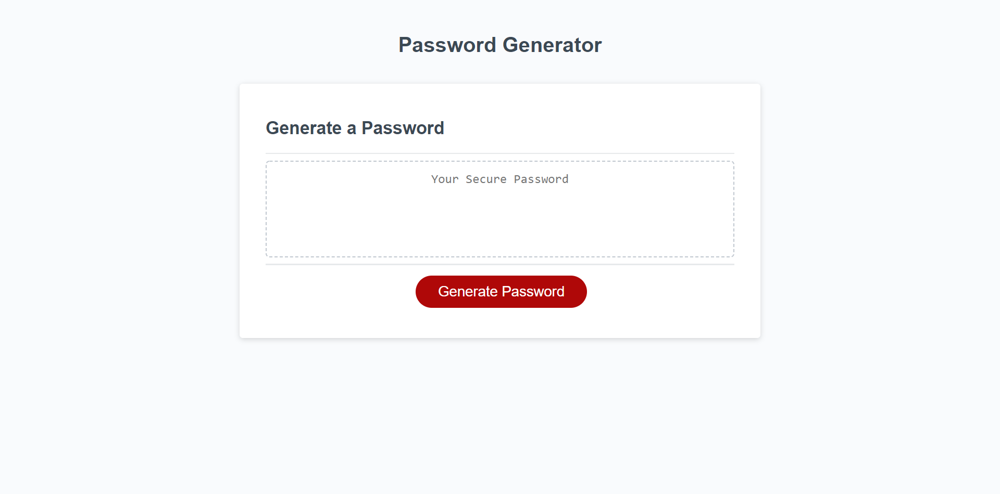

# 03 JavaScript: Password Generator

## Description

This application generates a random password based on desired criteria. 
Clicking "Generate Password" button will spawn a series of confirmation windows. These confirmations will ask the user which criteria will be included in the desired password. It will ask if the password will include special characters, lower-case letters, upper-case letters, and/or numbers. I no criteria is confirmed, the prompts will cycle until at least one is confirmed. Once the criteria are confirmed, a prompt will ask the user how many characters the password will contain. This prompt will also recycle if the input is less than 8 or greater than 128. The input is validated and an alert will notify the user which criteria was included and how many characters the password will have. Once that alert is confirmed, the randomly generated password will display on the application. 

Currently, the prompt that asks for the length of the password has no code to prevent the user from entering a non-integer. This is intended to be fixed at a later date.

## The Application

The following image shows the web application's appearance and functionality:

- - -
© 2021 Trilogy Education Services, LLC, a 2U, Inc. brand. Confidential and Proprietary. All Rights Reserved.
